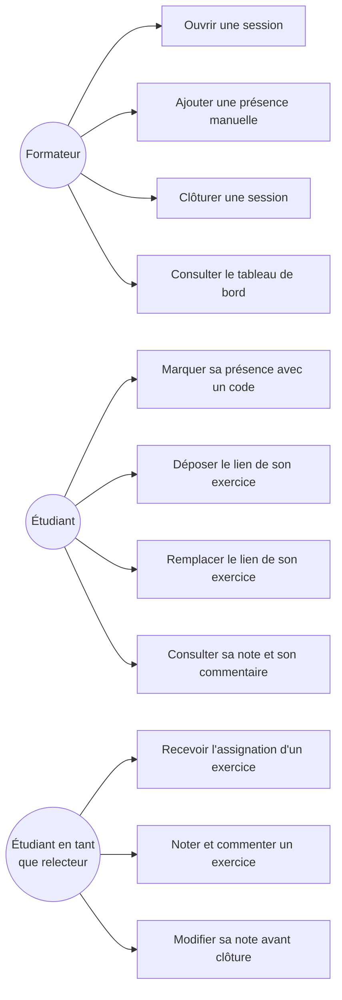

# D1 — Diagramme de cas d'utilisation

Remarque : "Étudiant en tant que relecteur" n'est pas un acteur séparé mais une
casquette que porte un Étudiant une fois qu'il a été assigné à une relecture
(RG6). L'assignation elle-même (UC9) est déclenchée par le système, pas par
une action volontaire de l'étudiant — elle est représentée ici du point de vue
du relecteur qui la reçoit.
