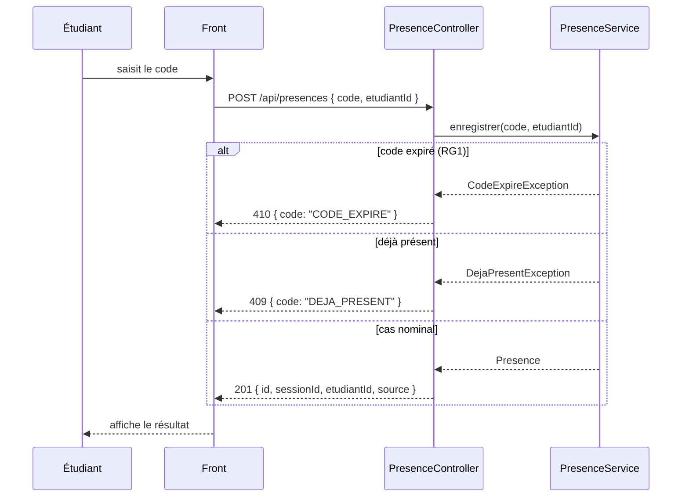

# D3 — Séquence : marquer sa présence

Correspondance avec le contrat d'API (`api/contrat.yaml`) :
- `410` et le code `CODE_EXPIRE` reprennent exactement les erreurs attendues sur `POST /api/presences`.
- `409` correspond au cas "déjà présent" du contrat.
- `201` avec le corps `{ id, sessionId, etudiantId, source }` reprend le format de succès imposé.
